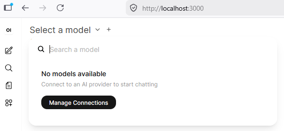
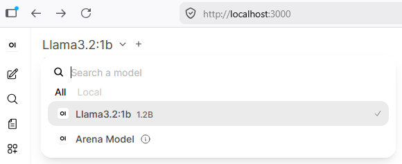
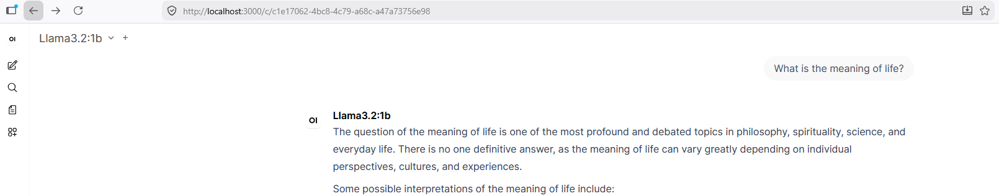

# Version 1

The first version is simply an Ollama container with a working model and a webUI. No customization yet.

* .env file for the settings (secret key and model name)
* docker compose for the containers

## Running it

```Shell
docker compose up -d
```

* Visit [http://localhost:3000](http://localhost:3000/) (or whatever IP you are running this machine on).
* Click "Get started"
* Full in your details ("abc123!" works as admin password)
* Click "Select a model"



* Despair as there is no model!

We've installed Ollama in a container, and Ollama is not an LLM, it's a piece of software that helps us to run an LLM. The actual LLM still needs to be downloaded. We'll do that manually in the Ollama-container.

```Shell
docker exec -it ollama ollama pull Llama3.2:1b
```

This will take a while, as it's now downloading the 1GB worth of tokens that Llama3.2:1b is made of. But once the download is done, you get the following on your openwebui:



Select the model and ask it some basic questions. You now have a working LLM, but without customization.



## Killing it

A working LLM without customization is a good way to start but not a good way to finish. Stop the containers before moving on (as we'll be reusing the volumes).

```Shell
docker compose down
```

## Summary

* Pros
    * Working LLM
    * WebUI to do inference
* Cons
    * Manually have to download the model
    * Basic, unchanged webui
    * No customization of the model