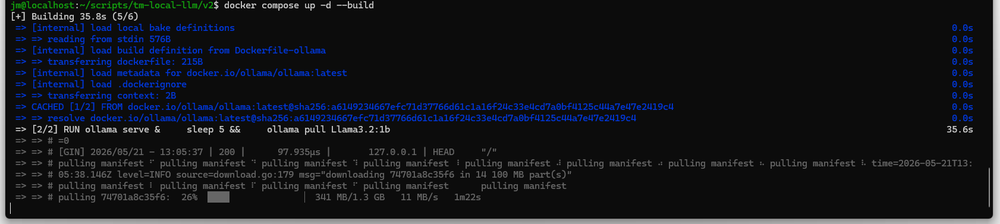
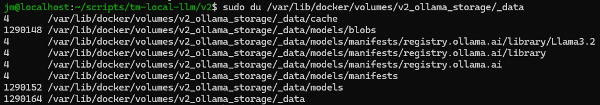

# Version 2

For version 2, we're looking at 2 big changes:

- We want the model to start ready to go, not that we have to download the model manually ourselves
- We want to step away from the openwebui and start building our own

Both mean we need a "Dockerfile". A dockerfile is a file we that defines the build steps for a custom docker image. So the difference:

- Dockerfile: defines image
- docker-compose.yml: defines the containers we run based on these images

A dockerfile can be integrated into a docker compose file, so you don't need to explicitly build the image seperatly.

## Models and volumes

First thing we'll be tackling is the Ollama container.

Your first thought might be to put this in your Dockerfile:

```Shell
FROM ollama/ollama:latest
RUN ollama pull llama3.2:1b
```
That would be a bad idea. During docker build, isolation laws apply. The daemon runs commands sequentially, meaning ollama pull will try to contact a local Ollama server daemon to manage the download—but that daemon (ollama serve) isn't running yet!

The solution:

```Shell
FROM ollama/ollama:latest
RUN ollama serve & \
    sleep 5 && \
    ollama pull llama3.2:1b
```

This way the model is only downloaded when the container boots for the first time, not when the image is made.

But what with my volumes? Because before we made a volume that would hold all the models. It was good to keep this separate as the models can become quite big in size and putting them into the image may not be a good idea.

Well, what will happen is the following:

- The image is created
- The image is booted
    - The model is downloaded and added to the docker image
- The volume is attached
    - If the volume is empty: the downloaded volume is moved into the volume
    - If the volume is not empty: the model in the image is hidden, and we only see the already existing models, not the new ones

This means 2 things:
* If we rebuild the docker image (even for a change unrelated to the model), we have to wait for the download of the model
* If we change the model but don't remove the volume, the new model will get downloaded but can't be used

## Custom API

We used the openwebui before to have an interface to talk to the LLM. It made accessing the model easier, but wasn't really neccessary, as we could have also communicated with the ollama's API-interface directly. For humans thats not really an improvement, but when you're setting up machines to use the LLM you could have simply not run openwebui.

There is another reason to stop using it: context. LLM's work better when they have enough context and when we insert that context on every interaction with the model, it will respond much better.

For now we'll do it like this:
- We still run openwebui
- We write an API using python Flask that interacts directly with the LLM and inserts context
- In a later step we'll also put this application in a Docker container

## Dockerfile

First, we'll remove the volume that we created when running the containers before.

```Shell
docker volume rm v1_ollama_storage
```

We'll use the following dockerfile ("Dockerfile-ollama"):

```Shell
FROM ollama/ollama:latest
ARG CHOSEN_MODEL
RUN ollama serve & \
    sleep 5 && \
    ollama pull ${CHOSEN_MODEL}
```

Here we see the model is called "CHOSEN_MODEL". This is an Argument, passed through using "ARG". We see where this comes from in the build-step of de Docker-compose.yml.

```Shell
services:
  ollama:
    build:
      context: .
      dockerfile: Dockerfile-ollama
      args:
        - CHOSEN_MODEL=${MODEL_NAME}
    container_name: ollama
    volumes:
      - ollama_storage:/root/.ollama
    ports:
      - "11434:11434"

  open-webui:
    # No changes to before

volumes:
  ollama_storage:
  webui_storage:
```

And the .env-file:

```Shell
# The model Ollama should use
ACTIVE_MODEL=Llama 3.2:1b
MODEL_NAME=Llama3.2:1b

# Open WebUI security (put a random string here)
WEBUI_SECRET_KEY=super-secret-key-123
```

The model name is still in there twice, but that's because

And run the docker compose file. Make sure to add the build-step, it may not be neccessary when the image doesn't exist yet, but if a prevrious version of an image exists and you don't specify "--build" the old image will be used even when there are changes that should be pushed.

```Shell
docker compose up -d --build
```

When running, we see the model being downloaded:



And afterwards, we see the model in the folder representing the volume:



The blob-folder is about 1.23GB. That is where the model lives.